<div align="center">


# Layerive

**Turn one-off AI images into traceable, comparable, continuously evolving creative projects.**

A local, project-based AI image workspace. Inspired by Lovart's image-creation experience, Layerive brings image generation, editing, regional changes, outpainting, in-image text editing, conversations, and version relationships into one project — all saved on your own machine.

[](#-local-data-and-privacy)
[](#-local-data-and-privacy)
[](#%EF%B8%8F-tech-stack)

</div>

---

## Why Layerive?

Most AI image tools are centered on one-off chats. After twenty iterations, it is hard to find version seven again, remember the prompt behind it, or see which source image it came from. Layerive is centered on **projects and versions**: every generation or edit becomes a node in a version tree, so you can return to any point, continue from it, and compare branches.

Layerive is inspired by Lovart's image-creation workflow, but it does not depend on a hosted project or a fixed model provider. Images, conversations, versions, and model settings stay local. Connect SenseNova, OpenAI-compatible services, Gemini, Grok, or any gateway compatible with the OpenAI API format; choose the models, accounts, and pricing that work for you, reduce image-generation costs, and turn scattered outputs into manageable project assets.

> **In short:** this is not just another prompt-to-image page. It is a local workspace for sustained image creation.

> **Note:** Layerive is an independent local project with no official affiliation with Lovart. Lovart is mentioned only as a product-design reference.

## ✨ Current capabilities

### Project and asset management

- The home page supports card and list views, search, recent projects, favorites, duplication, and deletion.
- Project covers use a consistent landscape ratio and center-crop the source image without stretching it.
- Each new project opens in its own workspace; conversations, assets, versions, and project style prompts are automatically saved.
- Import project ZIP files, export individual projects (optionally including images), and create or restore complete local backups.

### Image creation and editing

- **Text to image** — generate from a text prompt.
- **Image to image** — continue from an uploaded image or a historical version.
- **Prompt-based image editing** — select an image and describe the change in natural language.
- **Regional editing** — draw a selection on the canvas and describe the change. A vision model uses the image and selection to prepare an edit prompt, while the image editor is instructed to preserve content outside the selection.
- **Outpainting** — choose a size or ratio supported by the current model, preview the expanded canvas, then submit an image-edit request.
- **Edit in-image text** — a vision model splits visible text into editable regions. Updated text is converted into a focused image-edit prompt. You can also manually select a region to add or replace text.
- **Project style prompts** — define a shared style for text-to-image generations while keeping the source-image context for edits.
- **Prompt gallery** — browse and reuse prompt and style templates directly in the workspace.

### Versions, conversation, and comparison

- Every generation, edit, regional edit, and outpaint operation creates a new version. Uploaded images can also become traceable starting nodes.
- Open the complete version tree, zoom and pan it, select a node to jump to it on the canvas, and branch from any version.
- The workspace keeps the prompt, selected model, version number, and output images for every turn. Reuse a prompt or continue from an output with one click.
- Compare images side by side or with a before/after slider, including against a selected historical image.

### Model integrations

Image models can be added, edited, tested, deleted, and set as defaults independently. Each project also remembers the default image model selected at creation time.

| Provider | Integration | Typical use |
| --- | --- | --- |
| SenseNova | Dedicated request adapter | Text-to-image, image-to-image, prompt editing; official watermark output is disabled by default |
| OpenAI-compatible | Images API or compatible gateway | Text-to-image, image-to-image, and prompt editing; exact support depends on the upstream model |
| Gemini | Native Gemini image API | Gemini Nano Banana and other supported image models |
| Grok | Native xAI image API | Grok Imagine image models |

- Configure a separate **vision model** for image text editing and regional-edit planning.
- Vision models support SenseNova and OpenAI-compatible APIs. Supported `dots3-note`-series models disable thinking to reduce text-recognition latency.
- Each model declares its own capabilities: text-to-image, image-to-image, prompt editing, or image understanding. The workspace only presents operations and sizes supported by the selected model.
- A built-in demo model lets you try projects, conversations, and versioning without an API key.

## 🚀 Getting started

### Requirements

- Node.js **22.13+**
- npm **10+**

### Development

```bash
npm install
npm run dev
```

Development mode starts the frontend and local API service. Open [http://127.0.0.1:5173](http://127.0.0.1:5173); the local API uses port `8788` by default.

### Build and run

```bash
npm run build  # Type-check and build into dist/
npm start      # Serve the frontend and local API
```

## 🧭 Suggested workflow (interface screenshots)

> Screenshots live in `doc/界面操作截图/`, in operation order — one glance covers the core flow.

| Step | Screenshot | Highlight |
| --- | --- | --- |
| 1 | 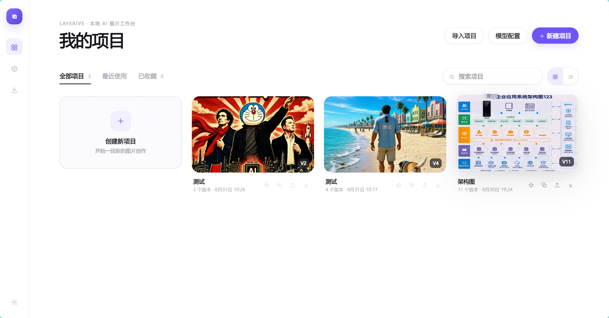 | **Project home** — card-based library; import / export / favorite / copy / delete, one-click new |
| 2 | 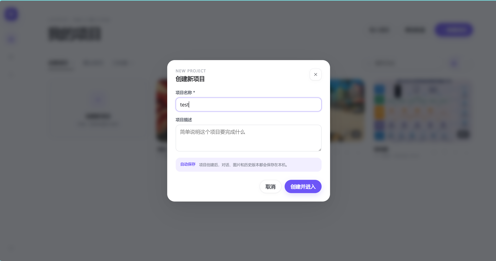 | **Create project** — name + description gets you into the workbench; auto-saved locally |
| 3 | 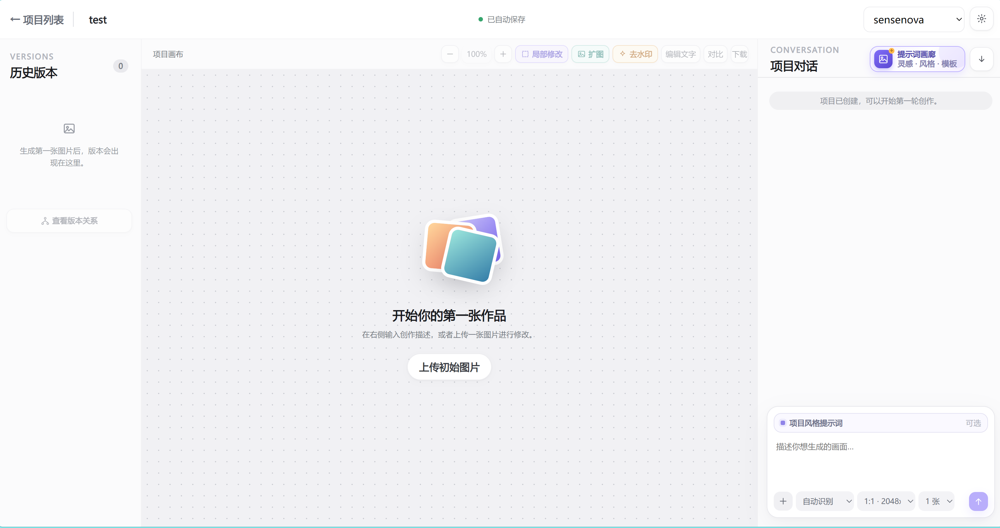 | **Workbench initial state** — three columns: versions · canvas · conversation; upload or type |
| 4 | 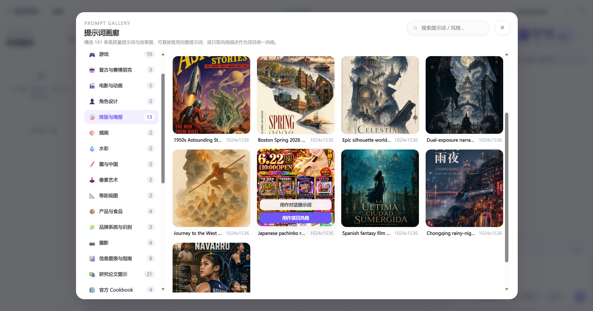 | **Prompt gallery** — 161 quality templates across 16+ categories, pick and reuse |
| 5 | 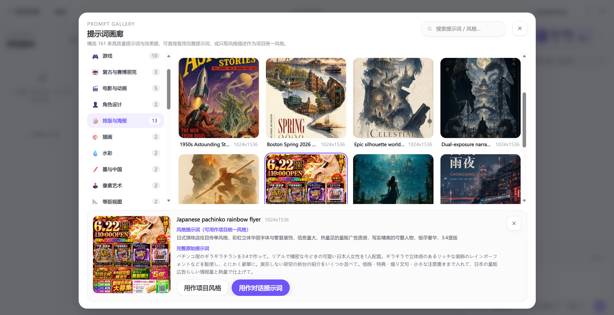 | **Apply a template** — one click to use as conversation prompt or project style |
| 6 | 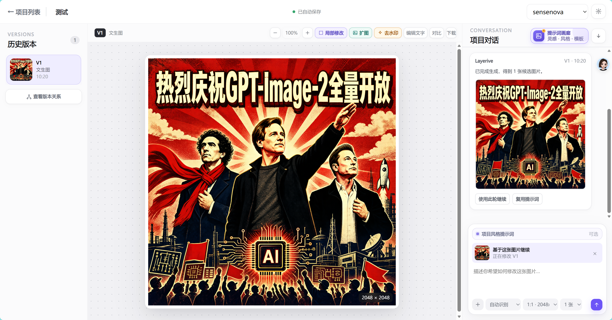 | **Text-to-image** — result lands in version history; reuse the prompt from the conversation |
| 7 | 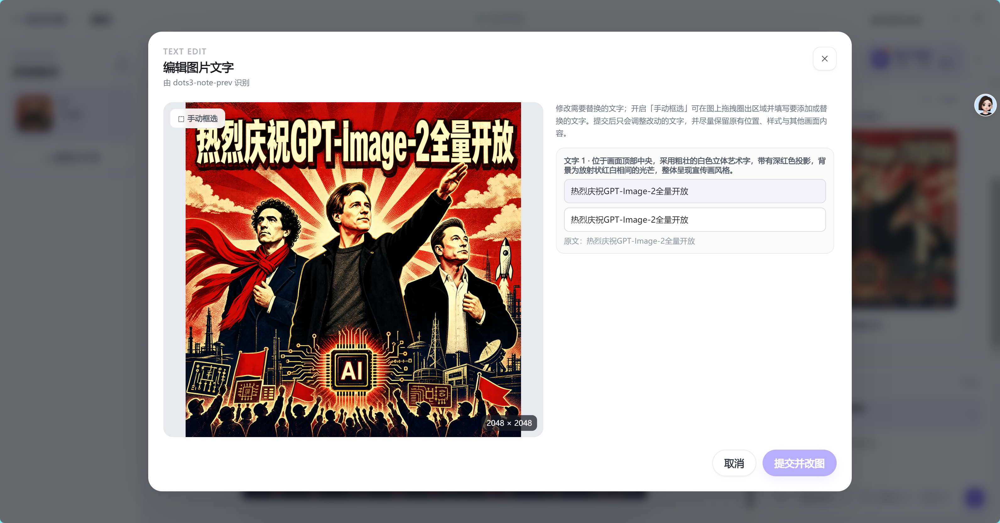 | **Edit image text** — vision model segments text; edits only change text, preserving layout |
| 8 | 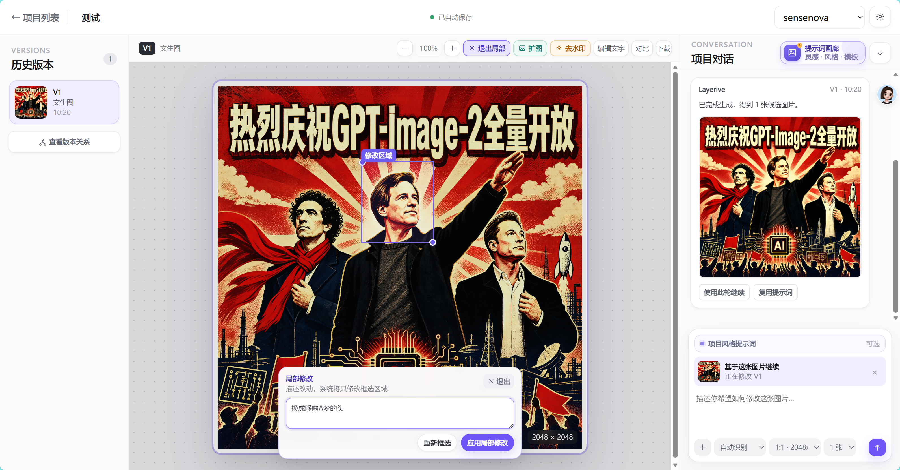 | **Regional edit** — box a region + natural-language instruction; only the box changes |
| 9 | 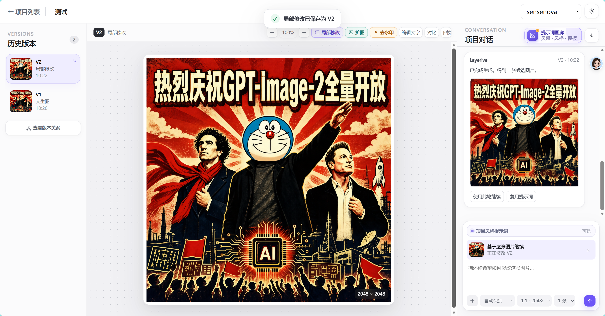 | **Regional edit result** — auto-saved as a new version; the rest of the image stays untouched |
| 10 | 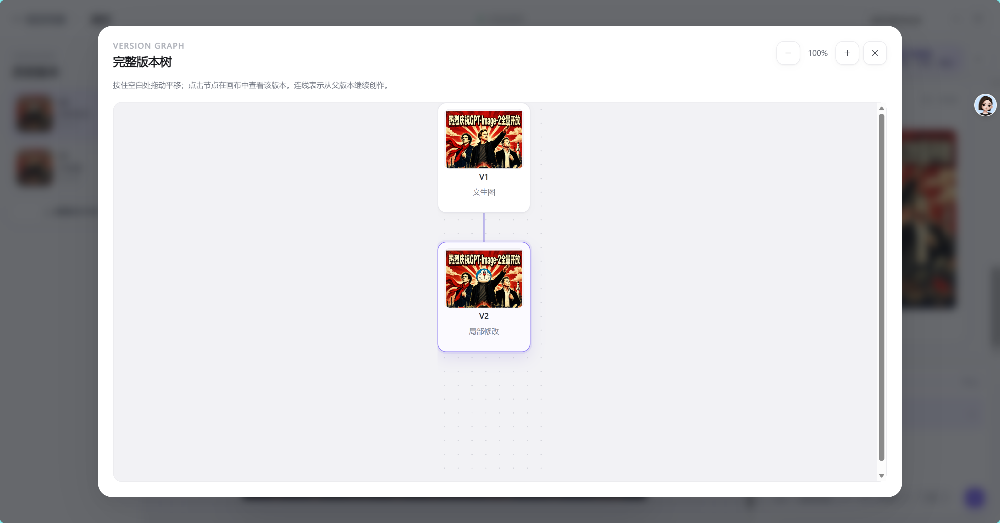 | **Version tree** — full relationship graph with parent/child links, branch and backtrack anytime |
| 11 | 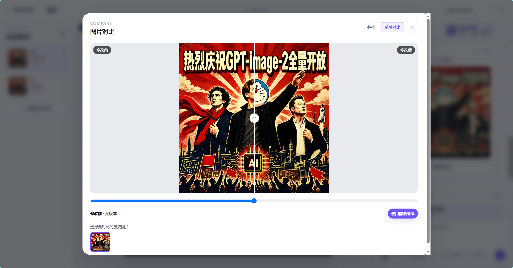 | **Compare** — side-by-side or slider before/after; one click to continue from either side |
| 12 | 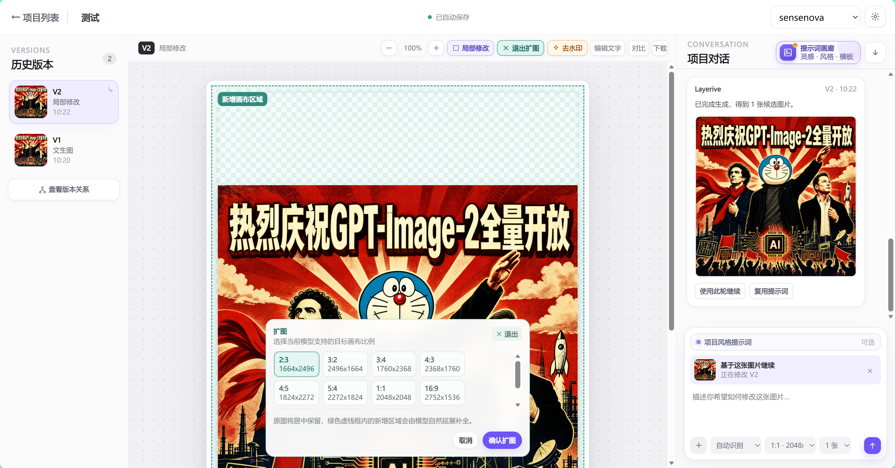 | **Outpaint** — pick a target ratio; original image stays centered, new areas extend naturally |

## 🔧 Configure real models

Open **Model configuration** from the home page or workspace:

1. Select **Add image model** or **Add vision model**.
2. Image models support **SenseNova / OpenAI / Gemini / Grok**. Vision models support **SenseNova / OpenAI-compatible** APIs.
3. Enter a display name, Base URL, API key, model name, and capabilities. Switching provider fills in matching endpoint and model examples.
4. Use **Test connection**, save the model, then set an image model as the default or a vision model as the recognition default.

### Configuration notes

- Parameter support is determined by the gateway for OpenAI-compatible services. For example, if `quality` accepts only `auto`, `low`, `medium`, or `high`, use one of those values in the model's default parameters.
- Text editing, regional editing, and outpainting require an image model with **prompt-editing** capability. Text and regional editing also require an enabled vision model.
- Available outpainting sizes are constrained by the active image model. Confirm the canvas preview before submitting.
- Output quality, text accuracy, and regional fidelity depend on the underlying model. For complex layouts, recognize text first and use manual selections to edit one region at a time.

## 🔒 Local data and privacy

- No account or sign-in is required. Project metadata is stored in `data/app.db`, and project images live in local directories under `data/`.
- Model configuration is stored in `config/models.json`, which may include API keys. Do not commit it to a public repository, and handle backups carefully.
- Full backups include project data and configuration. Keep a backup before restoring another one.

## 🏗️ Tech stack

| Layer | Technology |
| --- | --- |
| Frontend | React 19 · TypeScript · Vite |
| Backend | Native Node.js HTTP service |
| Database | SQLite (`node:sqlite`) |
| Image storage | Local filesystem, organized by project |
| AI integrations | SenseNova · OpenAI-compatible · Gemini · Grok · vision models |

Project layout:

```text
.
├── src/            # Home page, workspace, model configuration, and UI logic
├── server/         # API, task scheduling, model calls, and data access
├── public/         # Icons, PWA resources, and prompt-gallery assets
├── config/         # Local model configuration (generated at runtime; sensitive)
└── data/           # SQLite database and project images (generated at runtime)
```

## License

This repository does not yet include a standalone license file. Add and confirm an appropriate license before distributing or using it commercially.
