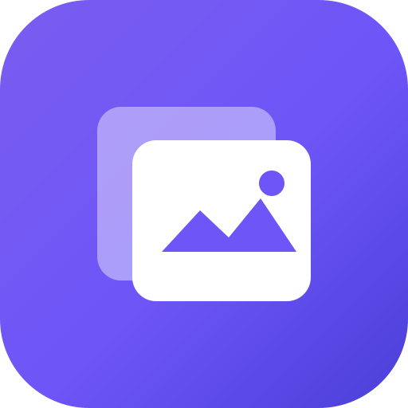

<div align="center">



# Layerive

**让 AI 图片从一次生成，变成可回溯、可比较、可持续迭代的创作项目。**

本地运行的项目式 AI 图片工作台。参考 Lovart 的图像创作交互，将图片生成、改图、局部修改、扩图、图片文字编辑、对话和版本关系收进同一个项目，内容自动保存到本机。

[](#-本地数据与隐私)
[](#-本地数据与隐私)
[](#%EF%B8%8F-技术栈)

</div>

---

## 为什么是 Layerive？

多数 AI 出图工具以单轮会话为中心：改到第 20 版后，很难找回第 7 版；也难以追溯一张图来自哪张原图、用了哪句提示词。Layerive 以**项目和版本**为中心，每次生成或修改都会成为版本树中的节点，随时可以回到任意节点继续创作、分支比较。

它参考 Lovart 的图像创作思路，但不依赖任何云端项目或固定模型服务：图片、对话、版本与模型配置都保留在本机。你可以自由接入日日新、OpenAI 兼容服务、Gemini、Grok，以及符合 OpenAI 兼容格式的任意中转站接口；按自己的模型、账号和价格策略选择服务，在控制图片生成成本的同时，把零散出图过程沉淀为可管理的项目资产。

> **一句话**：它不是单纯的提示词出图页，而是用于持续图片创作的本地工作台。

> **说明**：Layerive 是独立的本地项目，与 Lovart 没有官方关联；此处仅说明产品设计参考方向。

## ✨ 当前能力

### 项目与素材管理

- 首页项目库支持卡片 / 列表视图、搜索、最近使用、收藏、复制和删除。
- 每张项目封面统一按固定横向比例展示，原图居中裁切，不拉伸。
- 新建项目后进入独立工作台；对话、素材、版本和项目风格提示词会自动保存。
- 支持项目 ZIP 导入、单项目导出（可包含图片）、完整本地备份与恢复。

### 图片创作与编辑

- **文生图**：从文字描述直接生成图片。
- **图生图**：以上传图片或历史版本作为输入继续创作。
- **提示词改图**：选定一张图片后，通过自然语言描述修改要求。
- **局部修改**：在画布中框选区域、输入修改意见；视觉识别模型会结合图片和选区组织编辑提示词，编辑模型只调整框选范围并尽量保持框外内容不变。
- **扩图**：选择当前模型支持的目标尺寸 / 比例，在画布中预览扩图边界后确认；系统以当前图片为中心组织扩图提示词并发起编辑。
- **图片改字**：识别模型将图片可见文字按区域拆分为可编辑输入框；修改后由识别模型生成仅改文字的提示词，再交给改图模型处理。也可手动框选文字区域，新增或替换指定文字。
- **项目风格提示词**：为项目设定统一的文生图风格；改图操作保留原图语境。
- **提示词画廊**：在工作台快速浏览、复用提示词和风格模板。

### 版本、对话与对比

- 每次生成、编辑、局部修改或扩图都会产生新的版本；上传图片也会作为可追溯的起始节点。
- 可查看完整版本树，支持缩放、空白处拖拽平移、点击节点跳转画布，并从任意节点继续形成分支。
- 工作台会保留每轮提示词、所用模型、版本号和生成结果；可一键复用提示词或以本轮结果继续。
- 支持并排对比和滑块前后对比，也可从历史图片中选择对比对象。

### 模型接入

图片生成模型可单独新增、编辑、测试、删除并设为默认；每个项目也会记住创建时的默认模型。支持的图片提供商：

| 提供商 | 接入方式 | 适用能力 |
| --- | --- | --- |
| 日日新 SenseNova | 专用请求适配 | 文生图、图生图、提示词改图；生成请求默认关闭官方水印 |
| OpenAI 兼容 | Images API / 兼容中转接口 | 文生图、图生图、提示词改图，具体能力取决于服务端模型 |
| Gemini | Gemini 原生图片接口 | Gemini Nano Banana 等图片生成模型 |
| Grok | xAI 原生图片接口 | Grok Imagine 图片生成模型 |

- 可配置独立的**视觉识别模型**，用于图片改字和局部修改的图片分析与提示词规划。
- 视觉识别支持日日新以及 OpenAI 兼容接口；`dots3-note` 等已适配的视觉模型可关闭思考以缩短文字识别等待时间。
- 每个模型可声明文生图、图生图、提示词改图或图片理解能力。工作台只展示并调用当前选中模型支持的操作和尺寸。
- 内置演示模型，不填 API Key 也可以体验项目、对话和版本流程。

## 🚀 快速开始

### 环境要求

- Node.js **22.13+**
- npm **10+**

### 本地开发

```bash
npm install
npm run dev
```

开发模式会启动前端和本地 API 服务。浏览器访问 [http://127.0.0.1:5173](http://127.0.0.1:5173)，本地 API 默认使用 `8788` 端口。

### 构建与运行

```bash
npm run build  # 类型检查并构建到 dist/
npm start      # 启动本地服务，同时托管前端与 API
```

## 🧭 建议使用流程

1. 在首页新建项目，并选择适合项目的默认图片模型。
2. 在工作台输入描述生成图片，或上传 PNG / JPEG / WebP 图片开始图生图。
3. 选中画布图片后，可选择提示词改图、局部修改、扩图或编辑文字。
4. 在对话区复用提示词、在提示词画廊挑选模板；需要统一视觉语言时设置项目风格提示词。
5. 通过「查看版本关系」回顾分支；用对比功能确认修改效果，再从任意满意版本继续。

## 🔧 配置真实模型

从首页或工作台进入「模型配置」：

1. 选择「添加图片模型」或「添加视觉识别模型」。
2. 图片模型选择 **日日新 / OpenAI / Gemini / Grok**；视觉识别模型选择 **日日新 / OpenAI 兼容**。
3. 填写显示名称、Base URL、API Key、模型名和能力；提供商切换后会带入相应的默认接口地址与模型示例。
4. 点击「测试连接」，成功后保存；图片模型可「设为默认」，视觉识别模型可「设为识别默认」。

### 配置提示

- OpenAI 兼容中转站的参数范围由中转站决定。例如 `quality` 仅接受 `auto`、`low`、`medium`、`high` 时，请在模型默认参数中使用其允许值。
- 图片改字、局部修改和扩图均需要图片模型具有**提示词改图**能力；图片改字、局部修改还需要已启用的视觉识别模型。
- 扩图的目标尺寸会受当前图片模型的尺寸限制约束，确认前请以画布预览的边界为准。
- 生成质量、文字准确度和局部保真度受具体模型能力影响；复杂排版建议先做图片改字识别，再配合手动框选逐段处理。

## 🔒 本地数据与隐私

- 不需要注册或登录；项目元数据存于 `data/app.db`，项目图片保存在 `data/` 下的本地目录。
- 模型配置保存在 `config/models.json`，其中可能包含 API Key。请勿提交到公共仓库，也请谨慎处理备份文件。
- 完整备份会包含项目数据与配置；导入前建议先保留一份现有备份。

## 🏗️ 技术栈

| 层 | 技术 |
| --- | --- |
| 前端 | React 19 · TypeScript · Vite |
| 服务端 | Node.js 原生 HTTP 服务 |
| 数据库 | SQLite（`node:sqlite`） |
| 图片存储 | 本地文件系统，按项目归档 |
| AI 接入 | SenseNova · OpenAI 兼容 · Gemini · Grok · 视觉识别模型 |

目录速览：

```text
app/
├── src/            # 首页、工作台、模型配置与前端交互
├── server/         # API、任务调度、模型调用、数据读写
├── public/         # 图标、PWA 资源与提示词画廊素材
├── config/         # 本地模型配置（运行时生成，含敏感信息）
└── data/           # SQLite 数据库与项目图片（运行时生成）
```

## 许可

当前仓库未附带独立的许可文件。对外分发或商用前，请补充并确认适用许可。
