> 🇨🇳 中文版：[README_ZH.md](README_ZH.md)

<div align="center">

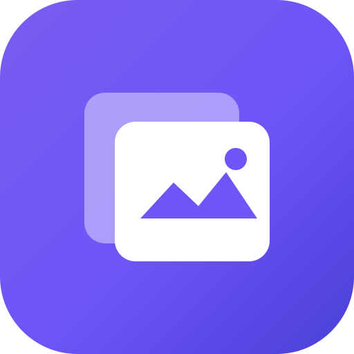

# Layerive

**A local image-creation workspace for work that grows beyond a single prompt.**

[](https://cdn.jsdelivr.net/gh/newljs/Layerive@e187a44f3198749d3f32ed8b88049c727a14e9ba/docs/%E6%BC%94%E7%A4%BA%E8%A7%86%E9%A2%91.mp4)

**1-minute product tour** — projects, text-to-image, regional editing, text editing, asset extraction, reference-image replacement, batch generation, version history, comparison, and the prompt gallery.

[▶ Watch the full demo video (MP4, about 5 MB)](https://cdn.jsdelivr.net/gh/newljs/Layerive@e187a44f3198749d3f32ed8b88049c727a14e9ba/docs/%E6%BC%94%E7%A4%BA%E8%A7%86%E9%A2%91.mp4)

Layerive keeps iterative image work in one local project. Start from a prompt or an existing image, then refine it: change text, replace a region, outpaint, or extract an asset. Every result becomes a version you can revisit, compare, or branch from—rather than another file or prompt lost in a chat history.

Connect the image and vision models you choose, without putting the project in a hosted workspace. Apart from requests sent to the model services you configure, your images, conversations, edit history, and model settings stay on your machine.

[](#local-data-and-privacy)
[](#local-data-and-privacy)
[](#tech-stack)

[Get started](#getting-started) · [Features](#features) · [Configure models](#configure-real-models) · [Workflow](#workflow) · [Privacy](#local-data-and-privacy) · [FAQ](#faq)

</div>

---

## What it is for

Prompt-to-image pages are good at generating a new image. They are less convenient when the job is to change one line of text, replace a subject, edit a selected region, or extend the canvas. Those changes often require repeated prompt revisions, and the model may still alter parts of the image that were meant to stay unchanged.

Layerive exposes these tasks as tools in the workspace: recognize and edit text, select a region and describe a change or provide a reference image, remove selected elements or automatically clean a whole image, choose a target ratio for outpainting, extract an asset, enhance an image, or remove a watermark. Enhancement, watermark removal, and whole-image cleanup can be started from their dedicated actions; text and regional edits work from recognized content or a selection. A vision model interprets the image and selection, while the image model performs the edit. You do not have to work out a long editing prompt or repeatedly regenerate the whole image for a local change.

The work stays in one project. Each generation or edit creates a version that can be revisited, compared, or used as the start of a new branch. Layerive does not require a hosted project or a fixed model provider. Apart from requests sent to services you configure, images, conversations, and version data stay local.

## Features

### Project and asset management

- The project library provides card and list views, search, favorites, duplication, renaming, and soft deletion.
- Each project stores its description, cover, current image, default model, and unfinished workspace state.
- The current tab remembers its open project workspace and restores it after a reload or browser background-tab discard.
- Projects can be imported or exported individually as ZIP files. Full local backup and restore are also available.

### Image creation and editing

- **Fusion** — open Fusion at the end of the canvas toolbar to collapse project chat and expand the canvas. Choose Basic fusion (default), Change outfit, Transfer pose, or Group photo in the right sidebar. A prominent Exit fusion button stays at the top of the sidebar and restores project chat and editing. Upload, paste, or select generated project images in the vertical reference list beside the canvas. Adding references keeps the main image in place. Drag a reference onto a target in the main image, or select a reference and click a target; optional instructions can refine the intent. A vision model interprets both images and the drop position before the image model edits them. Invalid references or ambiguous intent stop with an explanation. Requires a vision model and an image service that supports two-image editing. Results become new versions; tasks can be canceled, and failures keep the original and references. Static PNG/JPEG/WebP references are limited to 10MB each.
- **Text to image** — generate 1–4 images from one prompt. Multiple results belong to the same version, and any candidate can be selected for further editing. Providers that return one image per call are split into multiple requests and may bill each request separately; rate-limited requests retry automatically with backoff. No separate “distinct per image” switch is needed: for multi-image requests, the vision model automatically decides whether the prompt asks for normal same-content candidates or explicit per-image variants such as different emotions or concepts.
- **Image to image and prompt-based editing** — start from an uploaded, pasted, or historical image and describe the next change. The app chooses the supported output size closest to the source aspect ratio. SenseNova U1.5 Lite requests use a temporary provider-compliant copy without altering the local original.
- **Batch mode** — the right-hand conversation panel has “对话 / 批量” (chat / batch) mode tabs; picking “批量” defaults to batch text-to-image, and batch mode moves the former batch dialog into the sidebar. Batch workflows now enter through this tab only.
- **Model logs** — use the workspace header button beside Model configuration to inspect the current project's vision-planning output, generated prompts, sanitized request/response metadata, duration, and errors. Explicit provider reasoning fields are shown when available; API keys, image Base64, and returned image bytes are never stored in these logs.
  - **Batch editing** — use the image currently shown on the canvas as the shared reference, and insert one or more non-editable variable tags directly into a single prompt editor. Choosing 2–50 outputs creates a matrix with one image per row and one input per variable. A template such as “a consistent [head] humanoid wearing [outfit]” can use dog head + red jacket, donkey head + blue jacket, and so on; every row replaces all of its variables while keeping unrelated regions stable. You can also switch to the “提示词列表” (prompt list) tab and import a TXT file with one prompt per line, or paste multiple lines directly: the lines are echoed into an editable list, the line count becomes the output count (2–50 prompts, up to 1000 characters each), and each line is used verbatim as that image's full prompt without variable constraints.
  - **Batch text-to-image** — no input image needed: each prompt line produces an independent image, with the same variable-template and prompt-list input modes. A “unified style prompt” (initialized from the project style prompt, editable separately) is appended to every line to keep the whole batch consistent; the panel also offers output size (plus format and transparent background for openai providers).
  - **Shared behavior** — each result appears below the canvas as soon as it finishes, with remaining count and ETA; individual failures do not stop later items, and cancellation preserves completed outputs. Each row makes a separate image-model call and may be billed separately. The top-bar prompt gallery also works in batch mode: entry prompts are appended as list lines, and style entries feed the unified style prompt during batch text-to-image.
- **Image enhancement** — ask the image model to improve clarity and detail while keeping the subject, text, composition, and style as stable as possible.
- **Regional editing** — drag a selection from inside or outside the image, even beyond the workspace edge. Describe a change, or upload/paste a reference image in the selection panel (PNG/JPEG/WebP, up to 10MB). For example, select a person's head and upload a dog photo: the vision model infers the replacement intent, locates both subjects and plans a prompt, then the image model receives both full images and replaces the head directly. The prompt preserves the reference dog’s face, ears, coat and markings while adapting the replacement to the source pose and lighting. The selected image service must support multiple image inputs. Instructions are optional with a reference. Reference edits restore original pixels outside the selection and save a PNG at the source dimensions. Leave room inside the selection for connecting edges; blend quality depends on the model. Progress and cancellation cover planning, dual-image generation and restoring outside pixels. Text-only regional editing remains available. The panel also offers “批量修改” (batch mode): expand the side panel and enter one instruction per line (2–50 lines) to run the regional-editing pipeline repeatedly on the same selection — all results (sharing the attached reference, if any) are appended incrementally to one version, failures do not block later items, and cancellation preserves completed outputs.
- **Asset extraction** — a fusion-style sidebar offers Box selection (default intent recognition), Clothing, Accessories, Surface pattern, and Background. Box a region or use the whole image, preview the crop, and add optional instructions. Clothing and accessories become carefully arranged product images with clean light backgrounds while preserving their design and materials. Surface patterns are separated from their carriers and flattened; background extraction removes foreground subjects and fills occlusions. Planning and generation are cancellable, failed attempts retain the selection, and successful outputs become a new version linked to the original image.
- **Element removal** — a tool sidebar offers Box removal (default), Remove bystanders, Clear clutter, Clear all text, and Tidy room. Box removal still runs on release; other modes analyze the full image without individual selections. Bystander removal preserves main people, companions and scenery, with optional click markers for people to keep. Clutter cleanup preserves core subjects, text cleanup preserves its carriers, and room cleanup preserves layout, decor and major furniture. Instructions, progress and cancellation are supported. Only identified removal regions are updated, protected subjects retain their original pixels, and results become a new original-size PNG version.
- **Two-row canvas toolbar** — zoom, comparison, and downloads stay on the first row. Local edit, element removal, asset extraction, background removal, outpaint, enhancement, watermark removal, and text editing share a dedicated icon menu below it. The second row scrolls horizontally in narrow windows so English labels stay readable.
- **Outpainting** — choose a size or ratio supported by the current model, preview the expanded canvas, then submit an image-edit request.
- **Watermark removal** — a vision model checks for and locates a watermark before the image model repairs the affected region.
- **Background removal** — the vision model identifies the most likely primary person, animal, object, or interacting subject group by size, position, clarity, foreground depth, and relationships. The image model removes everything else and returns a transparent PNG. The server validates that the result contains both meaningful transparency and a visible subject, so an opaque white background or an empty image is rejected. The selected image model must support prompt editing, PNG output, and transparent backgrounds.
- **Edit in-image text** — a vision model splits visible text into editable regions. Replace text, clear it to remove it, or manually select a region to add content; output uses the closest supported size matching the source image's aspect ratio. Clicking submit closes the editor immediately and returns to the project conversation while vision planning and generation continue. If submission fails, the editor reopens with the original edits intact.
- **Reuse recognition results** — successful text recognition is stored locally per image and vision-model configuration. Images produced by “Edit in-image text” inherit the complete post-edit text snapshot, including replacements, removals, manual additions, and an intentionally empty result; every candidate in a multi-image result receives the snapshot. Reopening text editing therefore avoids another recognition pass, while switching or changing the vision model triggers a fresh recognition.
- **Project style prompts** — define a shared style for text-to-image generations while keeping the source-image context for edits.
- **Prompt gallery** — opened from the workspace top bar next to the model pickers. Browse built-in templates or maintain a personal library of prompts and reference images; in chat mode prompts drop into the composer and styles become the project style, while in batch mode prompts append to the batch list and styles feed the unified batch style during batch text-to-image. A vision model can derive prompts from an uploaded image, and workspace images can be added from their context menu.
- **Dark mode** — available from the home, workspace, and model-configuration headers, with the preference stored locally.
- **Language switching** — the interface supports Simplified Chinese (default) and English; the toggle sits next to the theme button on the home, workspace, and model-configuration headers. The preference is stored locally, and UI copy, server error messages, and system conversation messages all follow the selected language.

### Versions, conversation, and comparison

- Every generation, edit, batch run, image-enhancement, regional-edit, and outpaint operation creates a new version. Batch results are appended incrementally to one version. You can upload additional images even after a project already has images, then use each new upload as the input for later edits.
- Open the complete version tree, zoom and pan it, select a node to jump to it on the canvas, and branch from any version. Multi-image versions are marked with a thumbnail mosaic and image count in history, and all candidates can be downloaded together as a ZIP.
- The workspace keeps the prompt, selected model, version number, and output images for every turn. Prompts can be reused, and any result can become the next input.
- Compare images side by side or with a before/after slider, including against a selected historical image.

### Model integrations

Image models can be added, edited, tested, deleted, and set as defaults independently. Each project also remembers the default image model selected at creation time.

The workspace header lets you choose image-generation and vision-recognition models independently. The vision choice is saved per project and is used for text recognition/editing, regional-edit planning, element removal, watermark removal, asset extraction, and prompt distillation. Recognition caches remain isolated by the selected vision model.

| Provider | Integration | Typical use |
| --- | --- | --- |
| SenseNova | Dedicated request adapter | Text-to-image, image-to-image, prompt editing; official watermark output is disabled by default, and edit inputs are normalized automatically with automatic output sizing |
| OpenAI-compatible | Images API or compatible gateway | Text-to-image, image-to-image, and prompt editing; exact support depends on the upstream model |
| Gemini | Native Gemini image API | Gemini Nano Banana and other supported image models |
| Grok | Native xAI image API | Grok Imagine image models |

- Configure a separate **vision model** for image text editing and regional-edit planning.
- Vision models support Anthropic Messages, Chat Completions, and Responses API formats while retaining compatibility with existing SenseNova and `dots3-note` configurations.
- Each model declares its own capabilities: text-to-image, image-to-image, prompt editing, or image understanding. The workspace only presents operations and sizes supported by the selected model.
- A built-in demo model lets you try projects, conversations, and versioning without an API key.

## Getting started

### Requirements

- Node.js **22.13+**
- npm **10+**

### Development

```bash
npm install
npm run dev
```

Development mode starts the frontend and local API service. Open [http://127.0.0.1:5173](http://127.0.0.1:5173); the local API uses port `8788` by default.

### Build and run

```bash
npm run build  # Type-check and build into dist/
npm start      # Serve the frontend and local API
```

> [!TIP]
> For everyday local use, run `npm run build` once and then use `npm start`. Use `npm run dev` while changing code.

### Desktop app

The same source can be packaged as an Electron desktop application:

```bash
npm run desktop:dev   # Build and start Electron
npm run desktop:dist  # Create installer and portable packages
```

The desktop app stores its SQLite database, project images, gallery, and model configuration in the operating system's Layerive user-data directory, which is not replaced during application upgrades. The browser-local and desktop modes share feature code but keep separate local data by default; use full backup and restore to migrate projects.

Prebuilt installers are also published automatically to [GitHub Releases](https://github.com/newljs/Layerive/releases) by GitHub Actions whenever a `v*` tag is pushed — Windows (installer + portable), macOS (x64 + arm64 DMG), and Linux (AppImage + deb).

## Workflow

Screenshots are stored in `doc/界面操作截图/` and listed below in workflow order.

| Step | Screenshot | Description |
| --- | --- | --- |
| 1 | 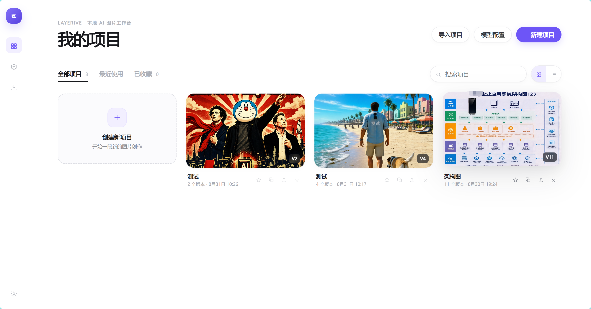 | Project library: import, export, favorite, copy, delete, and create |
| 2 | 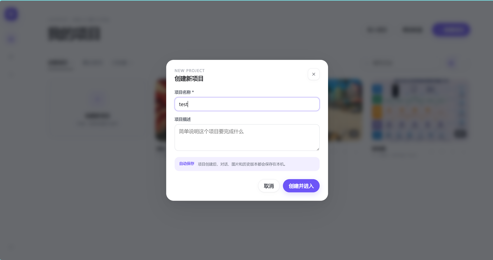 | Enter a project name and description |
| 3 | 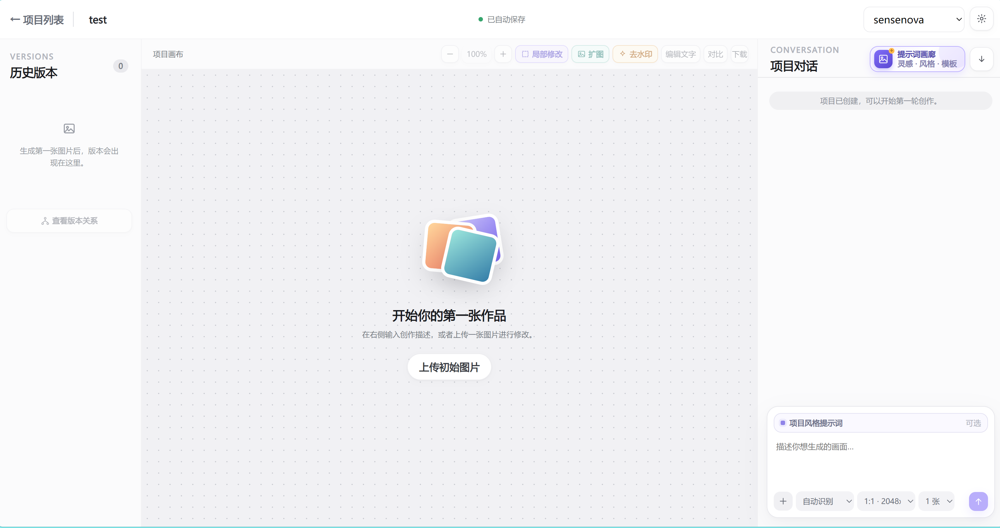 | Workspace with version history, canvas, and project conversation |
| 4 | 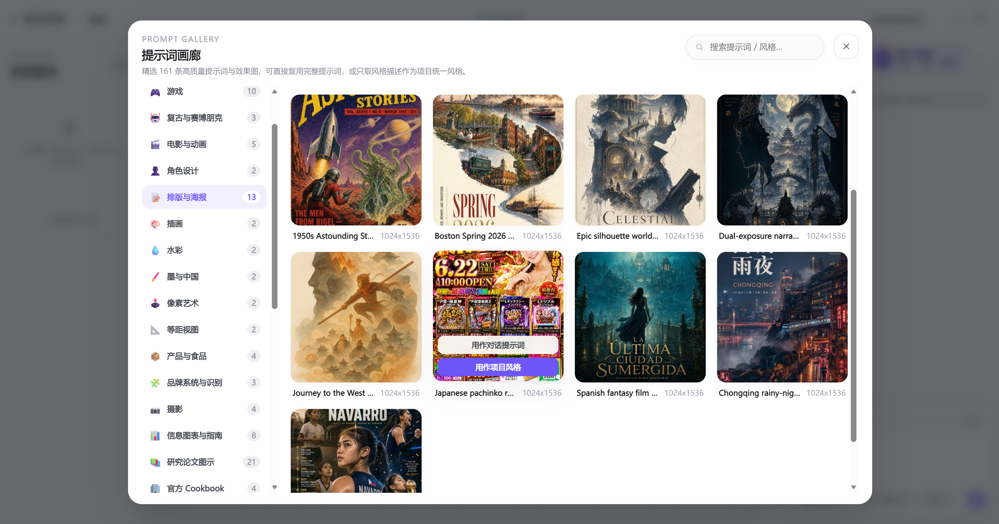 | Browse prompt templates by category |
| 5 | 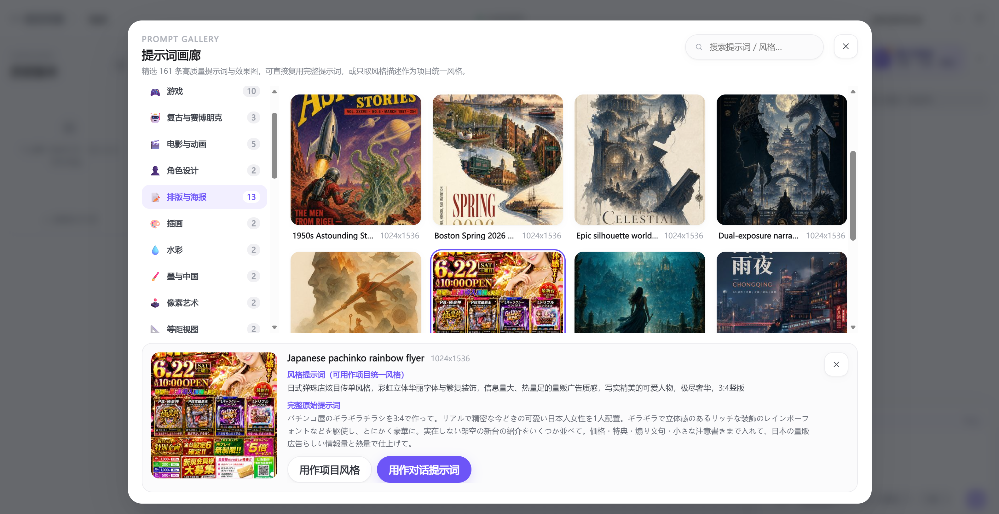 | Use a template in the conversation or as the project style |
| 6 | 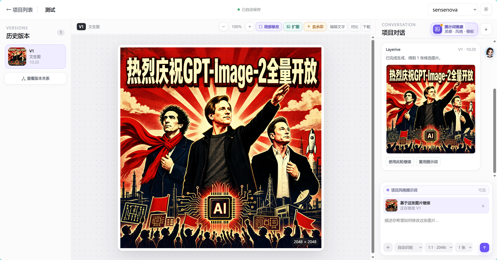 | Store generated results in version and conversation history |
| 7 | 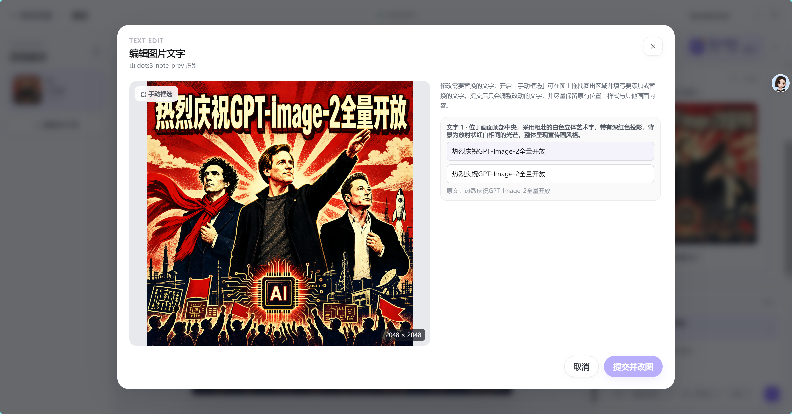 | Recognize and edit text in separate regions |
| 8 | 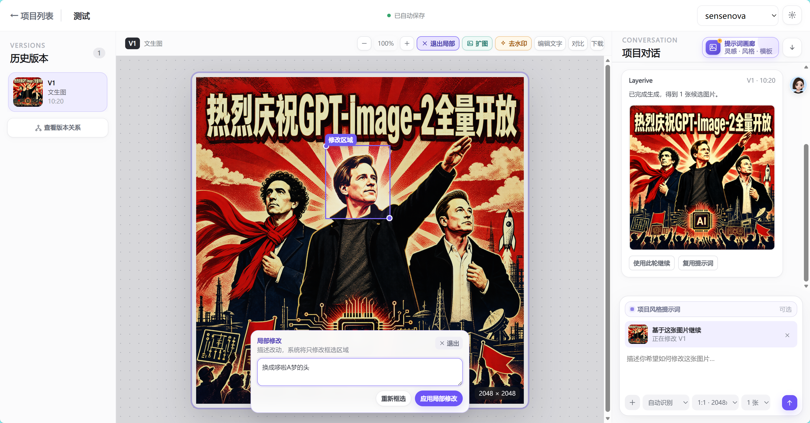 | Select a region and describe the required change |
| 9 | 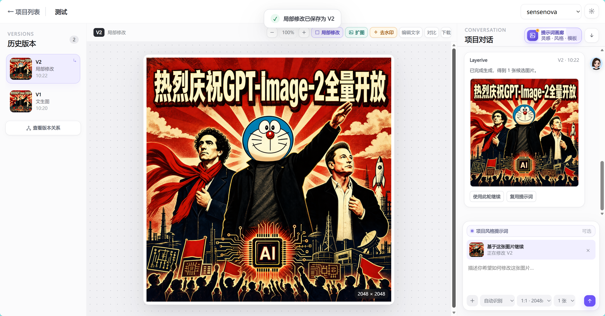 | Save the regional edit as a new version |
| 10 | 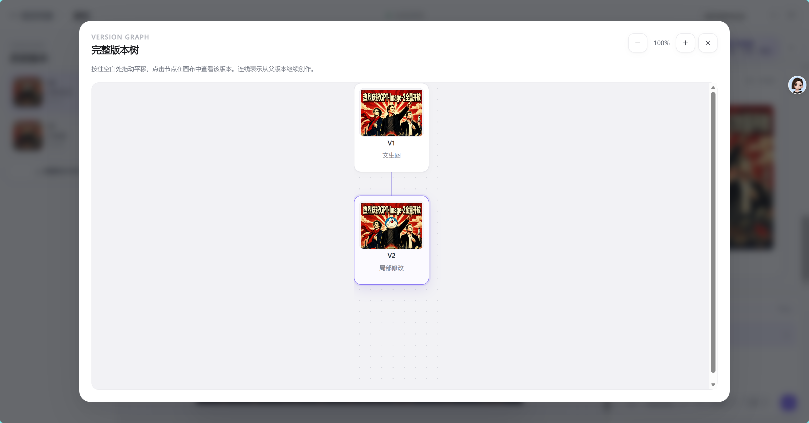 | View parent, child, and branch relationships |
| 11 | 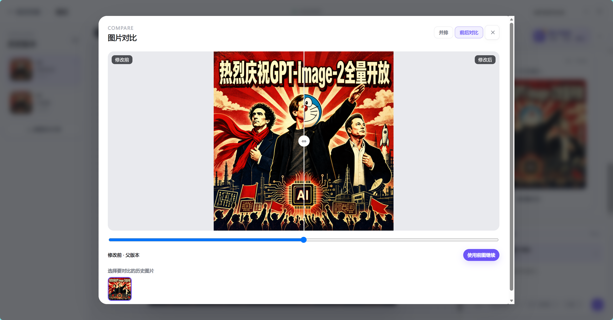 | Compare two images side by side or with a slider |
| 12 | 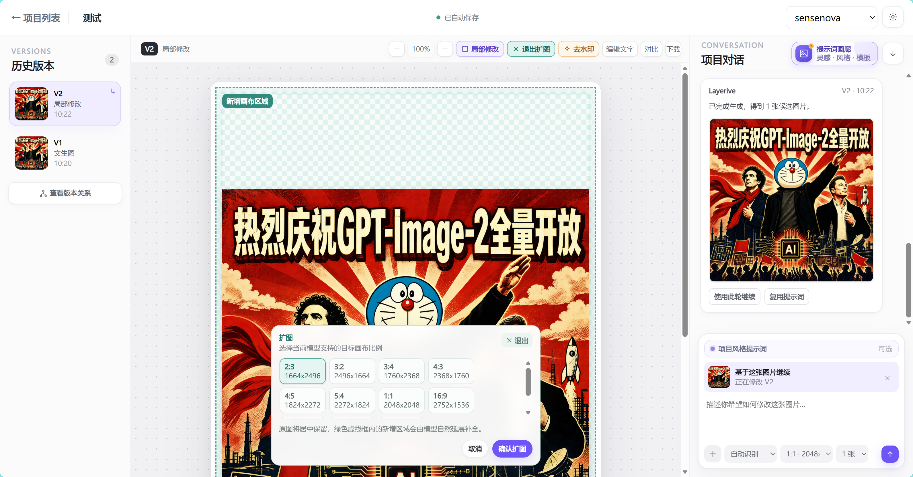 | Select a target ratio and preview the outpaint area |

## Configure real models

Open **Model configuration** from the home page or workspace:

1. Select **Add image model** or **Add vision model**.
2. For image models, choose a preset (**SenseNova / OpenAI / Gemini / Grok / Custom**) and the actual image API protocol (OpenAI Images, Gemini Interactions, or Grok Images) independently. Vision models support **Anthropic Messages / Chat Completions / Responses** API formats, with Chat Completions selected by default for new configurations.
3. Enter a display name, Base URL, API key, model name, and capabilities. Configure the sizes, output formats, transparent-background support, and maximum images supported by that model; the workspace only offers declared options. The button beside the API key toggles visibility and can reveal a previously saved key on demand. A preset fills in useful starting values.
4. Use **Test connection**, save the model, then set an image model as the default or a vision model as the recognition default.

| Model type | Supported providers | Primary use |
| --- | --- | --- |
| Image model | SenseNova, OpenAI, Gemini, Grok, or Custom presets; OpenAI Images, Gemini Interactions, or Grok Images protocols | Text-to-image, image-to-image, edits, outpainting, and more |
| Vision model | Anthropic Messages, Chat Completions, Responses | Analysis and prompt planning for text editing, regional edits, and asset extraction |

### Configuration notes

- For an OpenAI-compatible gateway, use the **Custom** preset and select the image protocol it actually implements. Declare only its supported sizes, output formats, and image count; the server enforces those limits.
- Text editing, regional editing, element removal, outpainting, enhancement, and asset extraction require an image model with **prompt-editing** capability. Text editing, regional editing, and element removal also require an enabled vision model.
- Available outpainting sizes are constrained by the active image model. Confirm the canvas preview before submitting.
- Output quality, text accuracy, and regional fidelity depend on the underlying model. For complex layouts, recognize text first and use manual selections to edit one region at a time.

## Local data and privacy

- No account or sign-in is required. In browser-local mode, project metadata is stored in `data/app.db`, and project images live in local directories under `data/`. The desktop app stores equivalent data in its operating-system user-data directory.
- In browser-local mode, model configuration is stored in `config/models.json`; the desktop app stores it in its user-data directory. It may include API keys. Do not commit it to a public repository, and handle backups carefully.
- Full backups include project data and configuration. Keep a backup before restoring another one.
- The local API listens only on `127.0.0.1`; it is not directly exposed to your network or the internet. It also accepts requests only from the local application page, so other websites you visit cannot read your project data or download a backup.

## FAQ

### The page opens, but image generation fails. What should I do?

The demo model is only for exploring the workflow. In **Model configuration**, add a real image model, enter its API key, test the connection, and set it as the default.

### Why is text editing or regional editing unavailable?

Those operations need both an image model that can edit by prompt and a vision model for image analysis. Configure and enable both, then verify the image model has the **prompt-editing** capability.

### How do I move my data to another computer?

Export a full backup ZIP from the home page. On the new computer, install and start Layerive, then use Restore to import it. Restoration overwrites the current local data, so export a current backup first.

### What if a port is already in use?

Development uses frontend port `5173` and API port `8788` by default. Stop the process using the port; to change the API port, set `PIXELFLOW_API_PORT` before starting and update Vite's API proxy to match.

## Tech stack

| Layer | Technology |
| --- | --- |
| Frontend | React 19 · TypeScript · Vite |
| Backend | Native Node.js HTTP service |
| Database | SQLite (`node:sqlite`) |
| Image storage | Local filesystem, organized by project |
| AI integrations | SenseNova · OpenAI-compatible · Gemini · Grok · vision models |

Project layout:

```text
.
├── src/            # Home page, workspace, model configuration, and UI logic
├── server/         # API, task scheduling, model calls, and data access
├── public/         # Icons, PWA resources, and prompt-gallery assets
├── config/         # Local model configuration (generated at runtime; sensitive)
└── data/           # SQLite database and project images (generated at runtime)
```

## Useful commands

```bash
npm run dev    # Start frontend and API in development mode
npm run lint   # Type-check TypeScript
npm run build  # Type-check and build the frontend
npm run test:local-edit  # Run regional-edit regression tests
npm start      # Start the local production service
```

## Star History

<a href="https://star-history.com/#newljs/Layerive&Date">
 <picture>
   <source media="(prefers-color-scheme: dark)" srcset="https://api.star-history.com/svg?repos=newljs/Layerive&type=Date&theme=dark" />
   <source media="(prefers-color-scheme: light)" srcset="https://api.star-history.com/svg?repos=newljs/Layerive&type=Date" />
   
 </picture>
</a>

---

## License

This project is licensed under the [GNU Lesser General Public License v3.0](LICENSE) (or later).

Copyright (c) 2026 newljs
